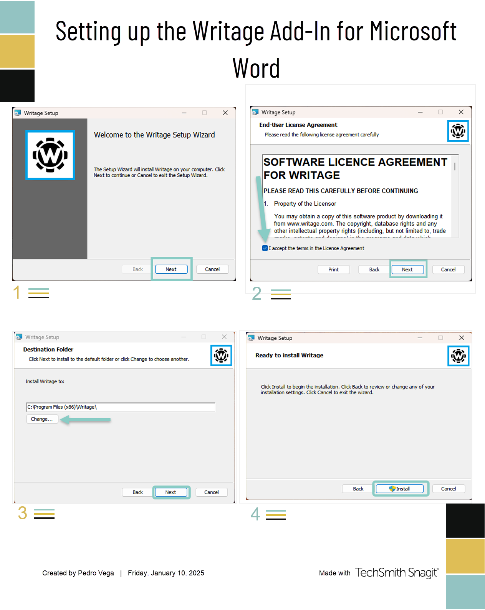
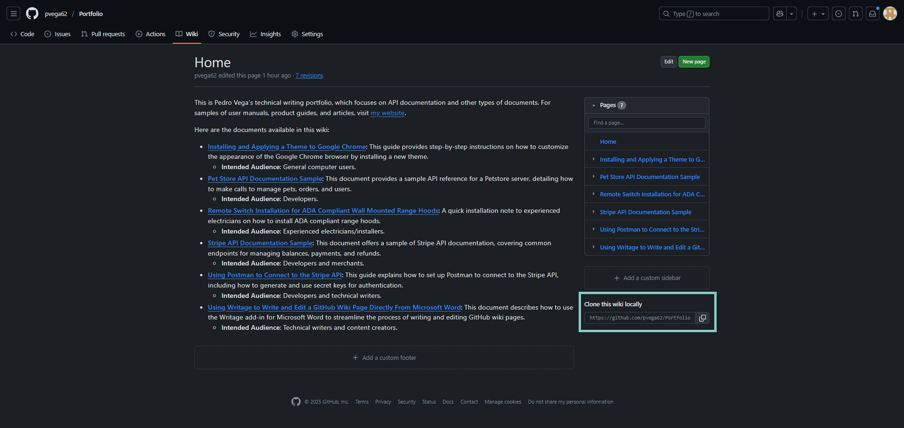
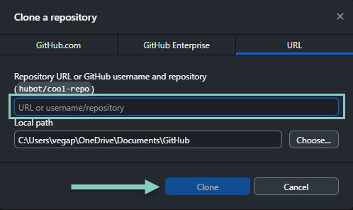
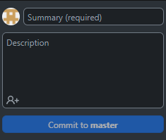

## Introduction
This is a guide on how to use the Writage add-in for Microsoft Word to write and edit GitHub wiki pages directly from Word.

This could be beneficial for writers who prefer Word's familiar interface and features, while still being able to leverage GitHub's version control and collaboration capabilities.

Writage is a Markdown editor add-in for Microsoft Word. It allows users to write and edit Markdown documents directly within Word, making it easier to create and format content for GitHub wikis.

**NOTE:** A Markdown document pushed to the wiki repository will appear as a new page on the wiki.

## Prerequisites

-   [The Writage add-in for Microsoft Word](https://www.writage.com/).
    -   **NOTE**: Writage comes with a 14-day free trial. Afterward, a license will have to be purchased.
-   [The latest version of Microsoft Word](https://www.microsoft.com/en-us/microsoft-365/download-office).
-   [The latest version of GitHub Desktop](https://desktop.github.com/download/).
-   An existing GitHub Repository with a wiki.

## Instructions

### Setting up Writage

1.  Follow the installation prompts to set up the Writage add-in.

### Writage in Microsoft Word

Once the Writage add-in is installed, a Markdown document can be written and edited like a regular Word document. With Writage, you can open existing Markdown files directly in Word, and save Word documents as Markdown files.

### Converting a Markdown Document into a PDF

1.  Open the Markdown document in Word.
2.  Click **File \> Save as.**
3.  Select **PDF** in the file type drop-down menu.
4.  Save the file in a chosen location.

### Cloning a GitHub Wiki to GitHub Desktop

A GitHub wiki is not automatically cloned to GitHub Desktop like other repositories. It will have to be cloned manually.

1.  Open the wiki and copy the URL in the page’s lower right corner.

    

2.  In GitHub Desktop, press **CTRL+SHIFT+O** to open the "Clone a Repository" dialog.
3.  Click on the **URL** tab.
4.  Paste the wiki’s URL and press **Clone.**

    

### Pushing a Markdown Document to a GitHub Wiki

Once a Markdown document is written in Word, it can easily be pushed to the GitHub Repository wiki without needing to copy and paste it to the GitHub Markdown editor and format it there.

1.  Save the Markdown document to the wiki folder set up when installing GitHub Desktop.
2.  Open the GitHub Desktop app.
3.  Select the wiki repository.
4.  Commit the changes (add a summary).
5.  Press **CTRL+P** to push the changes to the wiki.

**NOTE:** A summary must be added to the file before it can be pushed to the wiki. The summary briefly describes the changes made to the document, which helps other contributors understand the updates without reading the entire document.

6.  Open the wiki in a browser to double-check the updated wiki.

Repeat the steps to push the document to GitHub when a new document is created or an existing document is edited.

## Author's Note

This guide demonstrates a streamlined workflow for creating and managing GitHub wiki documentation using the Writage add-in for Microsoft Word. For technical writers and content creators comfortable with Word's interface, Writage serves as a valuable tool. It simplifies producing well-formatted Markdown content by bridging the gap between a powerful word processor and a collaborative development platform, eliminating the need to switch between applications.

As detailed in this Standard Operating Procedure (SOP), the process is straightforward: install the prerequisites, clone the GitHub wiki, author your documentation in Word, and push the final Markdown file to the repository. This workflow enhances productivity and ensures your documentation is consistent and professional.

This document was created as a sample for my technical writing portfolio. Its purpose is to showcase my ability to develop clear, concise, and user-friendly SOPs that guide users through a technical process from start to finish. As the author, I aimed to present a practical solution to a common documentation challenge, demonstrating both my writing skills and my understanding of content creation workflows for modern SaaS platforms like GitHub.
